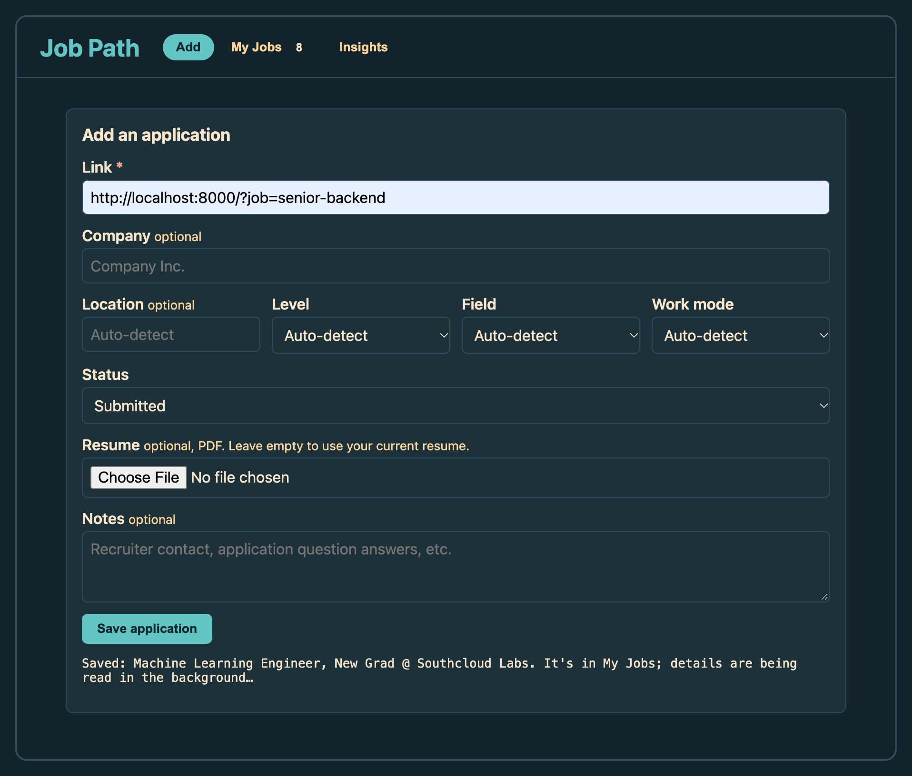
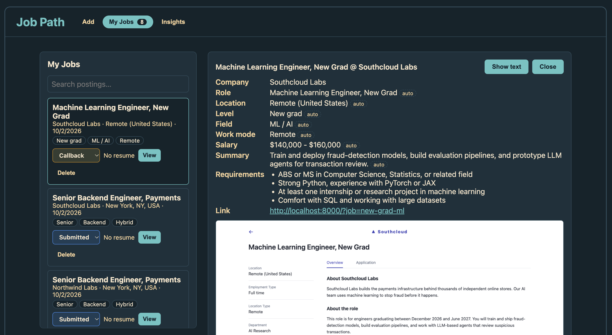
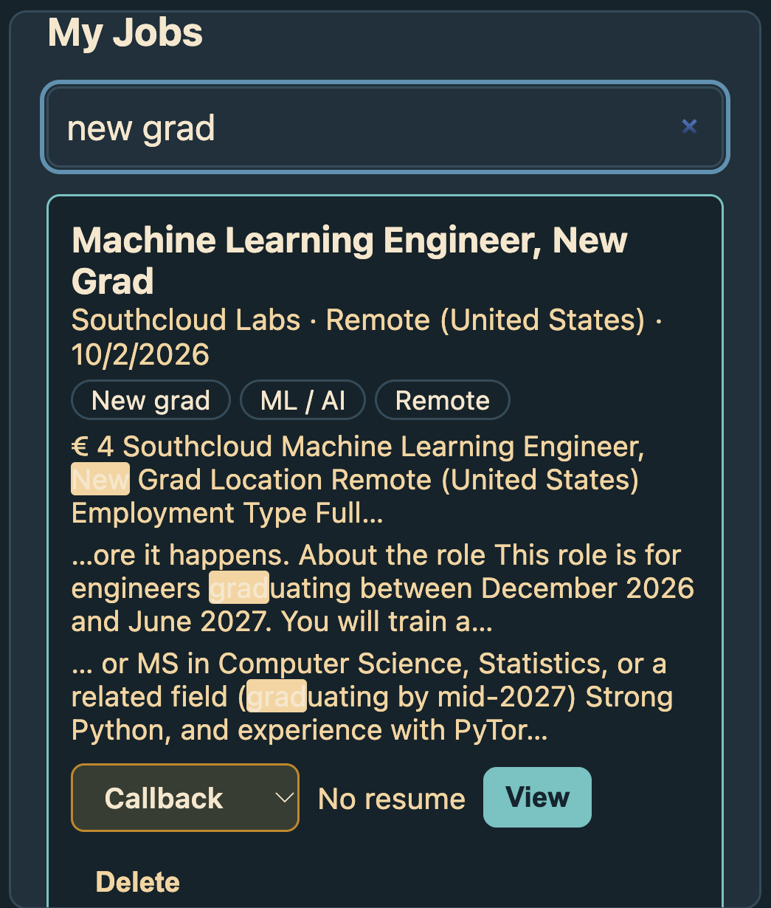
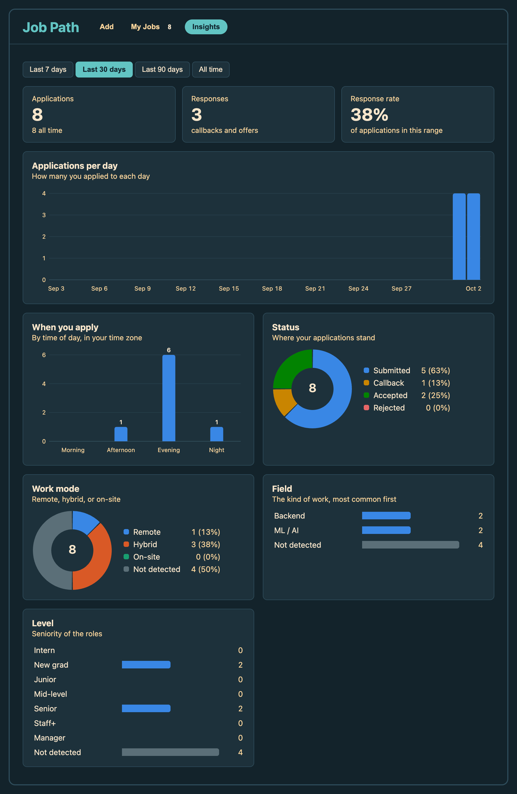

# Job Path 

Job Path keeps a record of every job you apply to, so you always know which role you applied for and what you submitted.

When you receive a follow up after applying to a job, it's easy to lose track of which position you applied to, what the posting said, or which version of your resume you sent. By then the original job post may already be taken down. Job Path saves the details of each application when you apply, so you can quickly find the role description and your submission to prepare for the next steps.

## Features

- **Save an application from a job posting link** Paste the job posting link. Company, location, level, field, work mode, status, resume, notes are optional, and anything you leave blank is filled in for you by AI.
- **A snapshot of the posting** Job Path saves a full picture of the page when you apply, so you can still read it after the company takes the posting down.
- **Search every posting** Search the text of all your saved postings from **My Jobs** to quickly find a company, a skill, or any other key word.
- **Details filled in for you** Leave a field blank and Job Path reads the posting to fill in the role, company, location, level, field, work mode, salary, key requirements, and a one-line summary. Anything you enter yourself always takes priority.
- **Know which resume you sent** Attach the resume you submitted with an application, and you can open that exact version later, even after you've updated your resume.
- **Track your status** Mark the status of each application as Submitted, Callback, Accepted, or Rejected.
- **Insights** See how many applications you send each day, what time of day you tend to apply, and how your applications break down by status, work mode, field, and level, for the last 7, 30, or 90 days or all time. Charts update as soon as you add, change, or delete an application.

## Why this is more than a spreadsheet

- **The posting, not just a link** Links can expire, but Job Path keeps a snapshot you can reread anytime.
- **The resume you actually sent** Every application tracks its exact resume version.
- **No typing** Paste a link and the details fill in by themselves using AI
- **Search inside postings** Find any word across every posting you've saved, allowing you to quickly find a job you have applied to
- **Insights for free** Charts of your job search helping you make informed decisions

## Demo

**Add an application.** Paste a link; everything else is optional.



**My Jobs.** Every application with its snapshot and the details Job Path filled in.



**Search.** Find any word across all your saved postings.



**Insights.** Your job search at a glance.



## How it works

1. You paste a link (and fill in anything else you like) on the **Add** tab.
2. Job Path opens the posting in a hidden browser, waits for it to finish loading, and takes a picture of the whole page.
3. It reads the text from that picture, so the posting becomes searchable. The picture and text are saved on your computer.
4. In the background, an AI model running on your computer reads the posting and fills in the details. This takes 30–60 seconds; you can keep using Job Path, and the details appear when they're ready.

## Requirements

Job Path runs on your own computer. You'll need:

- Python 3.12 or newer, and [uv](https://docs.astral.sh/uv/)
- Node.js 20 or newer, with npm
- [Tesseract](https://github.com/tesseract-ocr/tesseract), which reads text from the page pictures (on a Mac: `brew install tesseract`)
- [Ollama](https://ollama.com) with the `qwen2.5:7b` model (`ollama pull qwen2.5:7b`), which fills in the details. 
- git, to store versions of your resume

## Setup

Clone this repository, then run: 

```bash
# Backend
cd backend
uv sync
uv run playwright install chromium

# Frontend
cd ../frontend
npm install
```

## Running

Each time you use Job Path, start these in two separate terminal windows:

```bash
# Backend
cd backend
uv run app.py

# Frontend
cd frontend
npm run dev
```

Then open **http://localhost:5173** in your browser. Keep Ollama open if you want details filled in automatically.

## Your data

Your data is not uploaded anywhere. Your applications, snapshots, and resume versions are kept on your device.

## Limitations

- Some job sites, like LinkedIn, don't let Job Path open their pages. For those, the snapshot may show a sign-in or error page; try the company's own careers page instead.  In the future, will need to allow options to manually paste job descriptions 
- Filled-in details take up to a minute to appear after you save, and only when Ollama is running.  
- The posting's text is read from a picture, so a word can be occasionally misread, and text inside images isn't included.
- Job Path runs on your own computer for your own use, so manual set up needed
